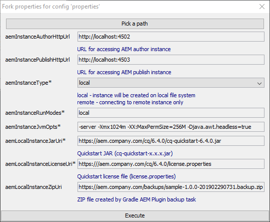

# Gradle Fork Plugin

[](http://www.apache.org/licenses/)

## Description

Project generator based on live archetypes (example projects).

## Usage

```groovy
buildscript {
  repositories {
      jcenter()
      maven { url  "https://dl.bintray.com/neva-dev/maven-public" }
  }
  dependencies {
      classpath 'com.neva.gradle:fork-plugin:1.0.0-beta2'
  }
}

apply plugin: 'com.neva.fork'

fork {
    config {
        copyFile()
        moveFile([
                "/example": "/{{projectName}}"
        ])
        replaceContent([
                "com.company.app.example": "{{package}}",
                "example": "{{projectName}}",
                "Example": "{{projectLabel}}"
        ])
    }
}
```

Fork configuration above will:

* copy all project files respecting files excluded in *.gitignore* files,
* rename directories using rules using properties injecting,
* replace contents using rules using properties injecting.

To execute fork configuration, run command:

```bash
sh gradlew fork
```

By default, fork plugin will interactively prompt for missing properties to be injected which will be used to perform all defined rules.

Properties can be pre-populated by specyfing command line parameter:

```bash
sh gradlew fork -Pfork.properties=fork.properties
```

Such file should be in format:

```bash
targetPath=../sample
projectName=sample
projectLabel=Sample
package=com.neva.app.sample
```

If that file will not contain properties for all property placeholders used in rules, then missing property values will be prompted interactively by displaying GUI dialog:



To enforce displaying that dialog when even all properties have pre-populated values by properties file, use command line parameter:

```bash
sh gradlew fork -Pfork.interactive=true
```
